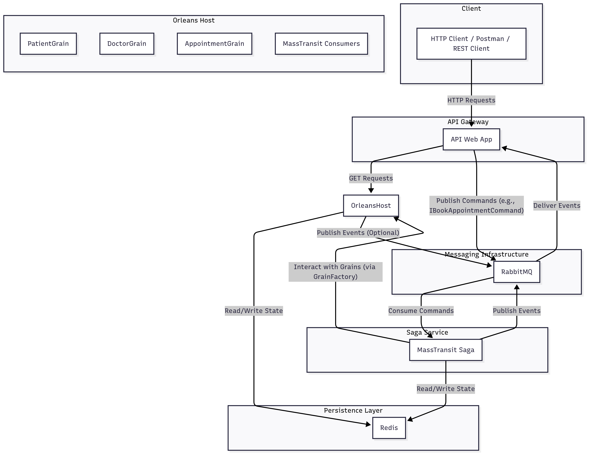

# Distributed Appointment Booking System (Orleans & MassTransit Saga)

## Project Description

This project implements a distributed appointment booking system for a medical clinic, utilizing an architecture based on **Microservices, Actors (Orleans), and Distributed Sagas (MassTransit)**. The goal is to robustly and scalably manage the process of booking, confirming, canceling, and completing appointments, ensuring consistency even in distributed environments.

### Key Objectives:

  * **Scalability:** Leveraging Orleans to manage the identity and state of entities like Patients, Doctors, and Appointments as scalable "grains."
  * **Robustness and Consistency:** Implementing sagas orchestrated via MassTransit (with RabbitMQ as the message broker) to handle complex and distributed workflows, ensuring that all operations related to an appointment are either completed or compensated in case of failure.
  * **RESTful API:** Exposing an HTTP interface for interacting with the booking system.
  * **Testability:** Ease of testing the workflow using `.http` files (VS Code REST Client).

## System Architecture

The system consists of the following main components:

1.  **`DistributedAppExamUnicam.Host` (Orleans Silo):**

      * The heart of the distributed system. It hosts the Orleans "grains."
      * **Orleans Grains:**
          * `PatientGrain`: Manages the state and operations related to a single patient (e.g., fetching appointments).
          * `DoctorGrain`: Manages the state and operations related to a single doctor (e.g., defining and retrieving availability, booking slots).
          * `AppointmentGrain`: Manages the state and lifecycle of a single appointment (Pending, Confirmed, Canceled, Completed).
      * **MassTransit:** Configured to interact with RabbitMQ, sending commands to consumers (which are integrated with the grains) and publishing events.
      * **State Persistence:** Uses **Redis** as the store for grain state persistence.

2.  **`DistributedAppExamUnicam.API` (ASP.NET Core Web API):**

      * Acts as the HTTP gateway for interaction with the system.
      * Exposes RESTful endpoints to create/retrieve patients, doctors, and initiate the appointment booking process.
      * Uses `IGrainFactory` to interact with Orleans grains and `IPublishEndpoint` from MassTransit to send commands (which trigger sagas).

3.  **`DistributedAppExamUnicam.Saga` (MassTransit Saga State Machine):**

      * Implements the transactional business logic for the appointment booking process.
      * Listens for commands (`IBookAppointmentCommand`, `IConfirmAppointmentCommand`, `ICancelAppointmentCommand`, `IMarkAppointmentCompletedCommand`, `IDeleteAppointmentCommand`) published by the API.
      * Coordinates operations between different grains (e.g., reserving a doctor's slot, creating the appointment) and handles failures via compensation (e.g., releasing the doctor's slot if booking fails).
      * The saga maintains its state persistently, ensuring process resumption even in case of crashes.
      * **Saga State Persistence:** The saga also uses **Redis** for its state persistence.

4.  **RabbitMQ:**

      * A message broker used by MassTransit for asynchronous communication between the API, the Saga, and the Grains/Consumers. It ensures message reliability and durability.

### Simplified Architectural Diagram



## Prerequisites

To run this project, make sure you have the following installed:

  * **.NET SDK 8.0** or higher.
  * **Docker Desktop** (for easily running RabbitMQ and Redis).
  * **Visual Studio Code** with the **REST Client** extension (for HTTP tests).
  * A C\# development IDE (e.g., **Visual Studio 2022** or **Rider** is recommended for debugging).

## Setup and Execution

### 1\. Start RabbitMQ and Redis with Docker

Open a terminal in the root directory of the project and start the Docker containers:

```bash
docker-compose up -d
```

Verify that the services are running:

  * **RabbitMQ Management UI:** `http://localhost:15672` (guest/guest)
  * **Redis CLI:** You can connect to `localhost:6379` to inspect data (optional).

### 2\. Run the Orleans Silo (Host)

In the solution, open a terminal in the `DistributedAppExamUnicam.Host` project directory (or set it as the startup project in Visual Studio) and run:

```bash
dotnet run
```

The silo will start and connect to RabbitMQ and Redis. You will see log output indicating the grains are starting.

### 3\. Run the API Service (ASP.NET Core)

Open a **new terminal** (or start a new project in Visual Studio) in the `DistributedAppExamUnicam.API` project directory and run:

```bash
dotnet run
```

The API will start, usually on `http://localhost:5055` (or another configured port).

### 4\. Run the Saga (MassTransit)

Open a **third terminal** (or start another new project in Visual Studio) in the `DistributedAppExamUnicam.Saga` project directory and run:

```bash
dotnet run
```

This will start the service hosting the MassTransit saga. It will connect to RabbitMQ and begin consuming commands.

**At this point, all main components of the system should be active and listening.**

### 5\. Run Tests using REST Client (VS Code)

1.  Open the `test.http` file located in the project's root directory (or wherever you saved it).
2.  Ensure that the variables `@baseUrl`, `@patient_id`, `@doctor_id`, `@slot_id`, `@appointment_id`, `@booking_correlation_id` are correctly set.
      * For initial testing, you can use the predefined IDs (static GUIDs).
      * If you want to test automatic ID generation for `AppointmentId` and `BookingCorrelationId`, ensure that your C\# code (`AppointmentsController`) has the `Guid.NewGuid()` logic enabled if `request.AppointmentId` or `request.CorrelationId` are `Guid.Empty`.
3.  For each section (e.g., "1.1 Create a new patient," "3.1 Request appointment booking"), click the "Send Request" link that appears above the HTTP verb (e.g., `POST`) to send the request.

**Suggested test flow:**

1.  Run the tests from section **1. PATIENT MANAGEMENT** onwards, in order.
2.  Pay close attention to section **3. BOOKING FLOW**, which triggers the saga. After sending the booking request (`3.1`), you should see logs in the Silo and Saga terminals indicating command processing and state changes.
3.  Verify that fetching appointments (`3.2`, `3.4`) reflects the state changes (Pending, Confirmed).
4.  Try the cancellation flow (`4.1`) and subsequent verification (`4.2`).
5.  Finally, execute the deletion test (`5.1`) and verify that the appointment is no longer retrievable (`5.2`).

## Additional Notes and Architectural Considerations

  * **Idempotency:** The operations exposed by the saga are designed to be as idempotent as possible, allowing MassTransit to retry messages in case of transient errors without causing undesired side effects.
  * **Compensation:** The saga includes compensation logic (e.g., `ReleaseTimeSlot` in the `DoctorGrain`) to manage the rollback of partially completed operations in case of subsequent failures in the workflow.
  * **Observability:** Console logs in each component provide a trace of the execution flow and state. In a real application, more advanced logging and monitoring systems (e.g., OpenTelemetry, Serilog) would be integrated.
  * **Message Contracts:** Contracts (`IBookAppointmentCommand`, `IConfirmAppointmentCommand`, etc.) are defined in a shared project (`DistributedAppExamUnicam.Messages`) to ensure consistency across services.
  * **ID Generation:** IDs for entities (Patients, Doctors, Slots) are managed via variables in the `.http` file. Appointment and saga correlation IDs can be generated by the client or the controller, depending on the configuration.

-----
